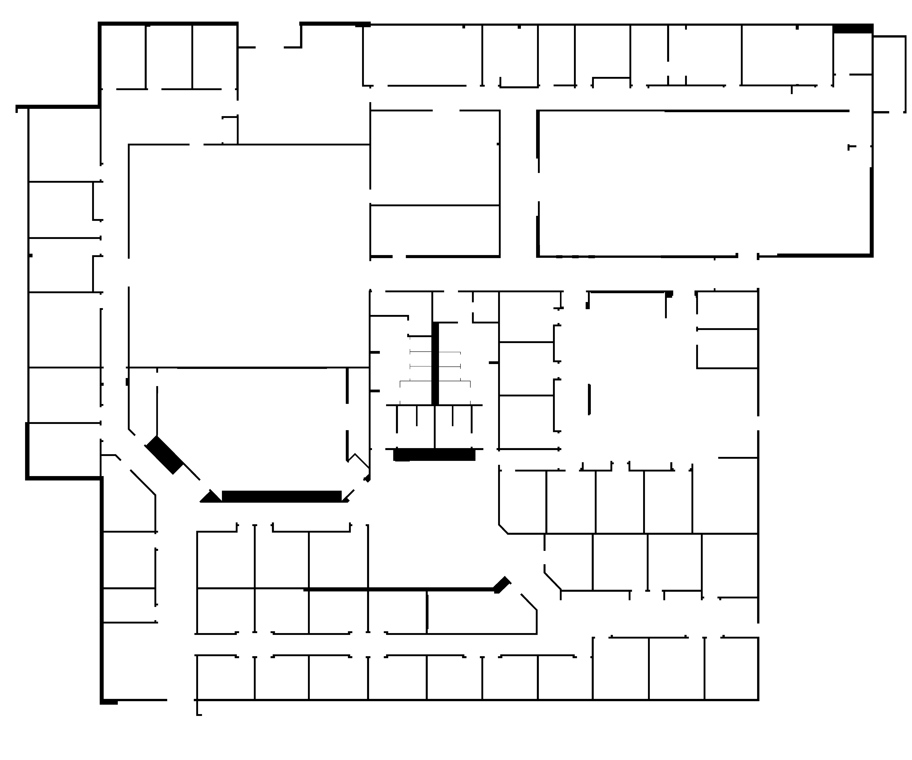

:tocdepth: 1

Gazebo Pluginを使って地図を作成する
=================================================================

Gazebo Pluginを使って地図を作成する
-----------------------------------------------------------------
このページではGazebo Pluginを使用する方法について説明します。
Gazebo Pluginを作成するのは発展的な内容を含むため、今回はすでに作成済みのプラグインを使用します。
この章で使われているGazebo Pluginのプログラムは :doc:`gazebo_map_builder` にあります。

まずは、プラグインが含まれているパッケージをダウンロードしてビルドしましょう。

.. code-block:: bash

  cd ~/catkin_ws/src
  git clone https://github.com/uenota/dronedoc.git
  cd ..
  catkin build

次に、地図出力用のプラグインを使えるようにするために、Worldファイルに以下の内容を追加します。

.. code-block:: xml

    <plugin filename="map_builder.so" name="map_builder"/>

以下の例の様になればOKです。

.. code-block:: xml

  <?xml version ='1.0'?>
  <sdf version ='1.4'>
    <world name='default'>
      <include>
        <uri>model://ground_plane</uri>
      </include>

      <include>
        <uri>model://sun</uri>
      </include>

      <include>
        <uri>model://willowgarage</uri>
      </include>

      <plugin filename="map_builder.so" name="map_builder"/>
    </world>
  </sdf>

地図を出力する
-----------------------------------------------------------------
マップを作りたいワールドを起動します。

.. code-block:: bash

  roslaunch gazebo_ros empty_world.launch world_name:=$HOME/catkin_ws/src/px4_sim_pkg/worlds/willow_garage.world

Gazeboが起動したら以下のコマンドを実行します。

.. code-block:: bash

  rosrun dronedoc request_publisher 10 0.01 "(-12,0)" 60 50 map.png 255

このコマンドを実行すると、x,y座標が(-12, 0)の点を原点として、50m x 60mの矩形に囲まれた領域の、高さ10mより下にある障害物のマップがカレントディレクトリに ``map.png`` として作成されます。
グリッドの間隔は0.01mで、グリッドが占有されていると判断するしきい値は255です。
また、同時に地図の設定ファイルも ``~/map.yaml`` として生成されます。

このコマンドの使用方法は以下のとおりです。

.. code-block:: bash

  Usage: rosrun dronedoc request_publisher a1 a2 a3 a4 a5 [a6 a7]
	a1: height
	a2: resolution
	a3: "(origin.x, origin.y)"
	  Origin is the point on lower left corner of map image
	a4: map_width
	a5: map_height
	a6: filename	[default="map"]
	a7: threshold	[default=255]

以下のようなワールドに対して上記のコマンドを実行すれば、

.. image:: imgs/willow_garage.png

次のような地図が生成されます。
画像左下が原点です。

