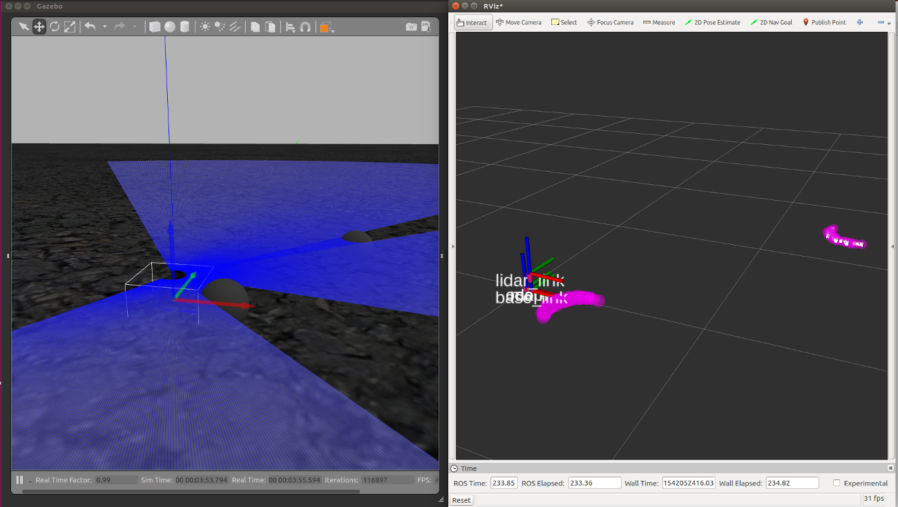

:tocdepth: 1

LiDARのデータをフィルタリングする
=================================================================

はじめに
-----------------------------------------------------------------
ロボットがLiDARの光線に干渉すると、ロボットの一部がスキャンデータに含まれてしまい、マッピングや自己位置推定の精度に影響を与える可能性があります。
このページでは、LiDARのデータをフィルタリングすることでロボットとの干渉を排除する方法を学びます。

LiDARのデータをフィルタリングするには、`laser_filters <http://wiki.ros.org/laser_filters>`_ パッケージを使います。
laser_filtersパッケージでは様々なタイプのフィルターが用意されており、これらを用いることで特定の距離の範囲のスキャンデータだけを抽出したり、特定の角度のスキャンデータだけを抽出したりできます。
また、複数のフィルタをつなげてフィルターチェインを作ることもできます。

設定ファイルを書く
-----------------------------------------------------------------
今回は特定の距離の範囲にあるスキャンデータを抽出するので、 `LaseScanRangeFilter` を使います。

`LaserScanRangeFilter` は距離を元にフィルタリングを行うフィルタです。
ここでは、yamlファイル内に設定を記述して、Launchファイル内でそれをロードすることでROSのパラメータを設定します。

以下の内容を、 config/laser_filter.yamlに保存します。

.. literalinclude:: ../../config/laser_filter.yaml
    :language: yaml
    :linenos:
    :caption: laser_filter.yaml

それぞれのパラメータの意味は以下のとおりです。

`name`
    フィルタの名前
`type`
    フィルタの種類
`use_message_range_limits`
    レーザースキャンのメッセージで定義されている最大値、最小値を用いるかどうか
`lower_threshold`
    小さい方の閾値。これ以下の距離のスキャンデータをフィルタする。
`upper_threshold`
    大きい方の閾値。これ以上の距離のスキャンデータをフィルタする。
`lower_replacement_value`
    `lower_threshold` 以下のスキャンデータにはこの値が使われる。
`upper_replacement_value`
    `upper_threshold` 以上のスキャンデータにはこの値が使われる。

パラメータの説明は `laser_filtersのROS Wikiページ <http://wiki.ros.org/laser_filters#LaserScanRangeFilter>`_ も参考にしてください。

今回の例では、0.5m以下のスキャンデータが全てフィルタされて値が-.infになります。
上限値は.infにしてあるので、0.5m以上のスキャンデータが置き換えられることはありません。

Launchファイルを作る
-----------------------------------------------------------------
今回もmymodel_sitl_tf.launchに追加する形で編集します。

以下の内容をLaunchファイルに追加することでlaser_filterパッケージを使用することができます。

.. code-block:: xml
    :linenos:

        <node pkg="laser_filters" type="scan_to_scan_filter_chain" name="laser_filter">
            <rosparam command="load" file="$(find px4_sim_pkg)/config/laser_filter.yaml" />
            <remap from="scan" to="laser/scan" />
        </node>

`<node>` タグでlaser_filtersパッケージを起動しており、 `<rosparam>` タグで先ほど作成した設定ファイルをロードしています。
また、laser_filtersパッケージは `scan` トピックにパブリッシュされるスキャンデータをフィルタリングしますが、今回はLiDARから `laser/scan` トピックにデータがパブリッシュされるので、リマップをしておきます。
laser_filtersによってフィルタリングされたメッセージは `scan_filtered` トピックにパブリッシュされます。

最終的に、mymodel_laser_filter.launchは以下のとおりになります。

.. code-block:: xml
    :linenos:
    :caption: mymodel_laser_filter.launch

    <launch>

        <node pkg="tf" name="base2lidar" type="static_transform_publisher" args="0 0 0.1 0 0 0 base_link lidar_link 100"/>
        <node pkg="tf" name="map2odom" type="static_transform_publisher" args="0 0 0 0 0 0 map odom 100"/>

        <arg name="vehicle" default="iris_2d_lidar"/>
        <arg name="sdf" default="$(find px4_sim_pkg)/models/iris_2d_lidar/model.sdf" />
        <arg name="verbose" default="false"/>
        <arg name="debug" default="false"/>

        <include file="$(find px4)/launch/mavros_posix_sitl.launch" >
            <arg name="sdf" value="$(arg sdf)" />
            <arg name="vehicle" value="$(arg vehicle)" />
            <arg name="verbose" value="$(arg verbose)" />
            <arg name="debug" value="$(arg debug)" />
        </include>

        <param name="/mavros/local_position/tf/send" type="bool" value="true" />
        <param name="/mavros/local_position/frame_id" type="str" value="odom" />
        <param name="/mavros/local_position/tf/frame_id" type="str" value="odom" />

        <!-- See http://wiki.ros.org/laser_filters for details -->
        <node pkg="laser_filters" type="scan_to_scan_filter_chain" name="laser_filter">
            <rosparam command="load" file="$(find px4_sim_pkg)/config/laser_filter.yaml" />
            <remap from="scan" to="laser/scan" />
        </node>

    </launch>

試してみる
-----------------------------------------------------------------
ちゃんとフィルタリングされるかどうか試してみましょう。

.. code-block:: bash

    roslaunch px4_sim_pkg mymodel_laser_filter.launch

ピンク色の点がフィルタリング前の点で、白の点がフィルタリング後の点です。
近くに置いてある球体の点が除去されていることがわかります

参考
-----------------------------------------------------------------
`Understanding ROS Services and Parameters <http://wiki.ros.org/ROS/Tutorials/UnderstandingServicesParams#Using_rosparam>`_
    ROSのパラメータの使い方