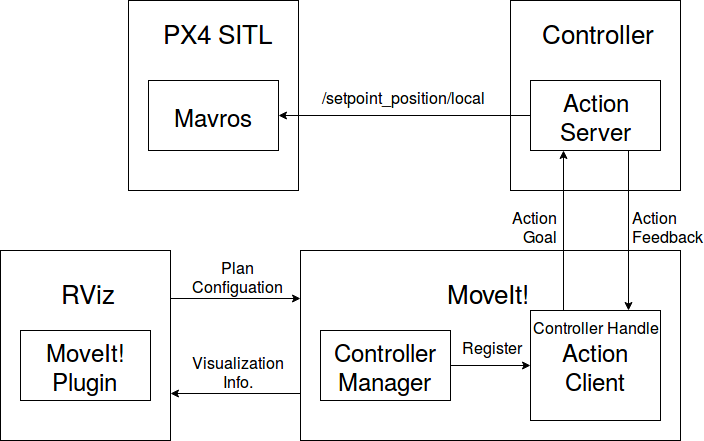

MoveIt!を使ってGazeboモデルを動かす
============================================================================
この記事では、前回までに作成したiris_moveit_configパッケージとMoveIt! RVizプラグインを使って経路計画を行い、ドローンの制御を行います。

MoveIt!を用いてロボットを動かす方法
----------------------------------------------------------------------------
MoveItSimpleControllerManager
^^^^^^^^^^^^^^^^^^^^^^^^^^^^^^^^^^^^^^^^^^^^^^^^^^^^^^^^^^^^^^^^^^^^^^^^^^^^
RVizで表示されるのはプランだけなので実際にロボットを動かすにはコントローラーが必要。
コントローラーマネージャ（MoveItSimpleControllerManager）がコントローラーハンドラ（follow_joint_trajectory_controller_handler）を登録し、FollowJointTrajectoryアクションを使ってコントローラー（FollowJointTrajectoryアクションのサーバーを提供するものなら何でもよい）に経路の情報を送る。
コントローラーは、コントローラーハンドラから送られてきた情報を元にロボットに制御指令を送り、実行結果や実行途中の状態をハンドラに送り返す。

コントローラーマネージャは、 ``controller_list`` パラメータに指定されたコントローラハンドラをMoveIt!に登録する。
MoveIt!に登録されたコントローラハンドラには（trajectory_execution_managerがsendTrajectoryを呼ぶことで）、経路の情報（RobotTrajectory）が与えられるので、これをアクションのゴールとして送信する。
MoveItSimpleControllerManagerは、follow_joint_trajectory_controller_handlerとgripper_controller_handlerだけに対応している。
follow_joint_trajectory_controller_handlerは他自由度の関節には対応していないので、他自由度の関節に対応したハンドラを使うためには、マネージャとハンドラの双方を新しく作成する必要がある。

自作のコントローラーマネージャを使う場合には、インターフェースクラスを継承したマネージャをmoveit_coreのプラグインとして登録する必要がある。

上述のように、この例ではコントローラハンドラは内部でアクションクライアントを定義しており、経路が実行されるタイミングでsendTrajectoryメソッドがコールされ、アクションのゴールが送信される。
そのため、経路の情報を使用してロボットを制御するためには、アクションに対応したアクションサーバーを作成する必要がある（コントローラ内でも別でもよい）。
コントローラは、コントローラハンドルから渡ってきた経路の情報を元にロボットを制御する。

- http://wiki.ros.org/moveit_msgs
- http://docs.ros.org/kinetic/api/moveit_tutorials/html/doc/controller_configuration/controller_configuration_tutorial.html

actionlib
""""""""""""""""""""""""""""""""""""""""""""""""""""""""""""""""""""""""""""

pluginlib
""""""""""""""""""""""""""""""""""""""""""""""""""""""""""""""""""""""""""""
- http://wiki.ros.org/pluginlib/Tutorials/Writing%20and%20Using%20a%20Simple%20Plugin
- http://wiki.ros.org/pluginlib/Troubleshooting

ros_control
^^^^^^^^^^^^^^^^^^^^^^^^^^^^^^^^^^^^^^^^^^^^^^^^^^^^^^^^^^^^^^^^^^^^^^^^^^^^

全体の構成
----------------------------------------------------------------------------
アプリケーション全体の構成は以下のようになっています。

RViz
^^^^^^^^^^^^^^^^^^^^^^^^^^^^^^^^^^^^^^^^^^^^^^^^^^^^^^^^^^^^^^^^^^^^^^^^^^^^
RVizは :doc:`../run_demo/run_demo` で見たように、経路の設定をMoveIt!側に送り、MoveIt!が生成した経路の情報を元に可視化を行います。

Controller
^^^^^^^^^^^^^^^^^^^^^^^^^^^^^^^^^^^^^^^^^^^^^^^^^^^^^^^^^^^^^^^^^^^^^^^^^^^^
MoveIt!の提供するロボットを制御するための制御入力を計算し

今回は、 ``FollowMultiDOFJointTrajectory`` アクションのGoalを受け取り、それをドローンに目標位置として送信するノードをコントローラーとして用います。

Controller Handle
^^^^^^^^^^^^^^^^^^^^^^^^^^^^^^^^^^^^^^^^^^^^^^^^^^^^^^^^^^^^^^^^^^^^^^^^^^^^
あ

Controller Manager
^^^^^^^^^^^^^^^^^^^^^^^^^^^^^^^^^^^^^^^^^^^^^^^^^^^^^^^^^^^^^^^^^^^^^^^^^^^^
Controller Managerはロボットを制御するための各種Controller Handle（FollowJointTrajectoryなど）をMoveIt!に登録する役割があります。
Controller

Controller
----------------------------------------------------------------------------

.. literalinclude:: ../../../../src/drone_controller.cpp
    :linenos:
    :language: cpp
    :caption: drone_controller.cpp

Controller Handle
----------------------------------------------------------------------------

.. literalinclude:: ../../../../include/dronedoc/follow_multi_dof_joint_trajectory_controller_handle.hpp
    :linenos:
    :language: cpp
    :caption: follow_multi_dof_joint_trajectory_controller_handle.hpp

Controller Manager
----------------------------------------------------------------------------

.. literalinclude:: ../../../../src/moveit_multi_dof_controller_manager.cpp
    :linenos:
    :language: cpp
    :caption: moveit_multi_dof_controller_manager.cpp

moveit_multi_dof_controller_manager_plugin_description.xml
^^^^^^^^^^^^^^^^^^^^^^^^^^^^^^^^^^^^^^^^^^^^^^^^^^^^^^^^^^^^^^^^^^^^^^^^^^^^

CMakeLists.txt
^^^^^^^^^^^^^^^^^^^^^^^^^^^^^^^^^^^^^^^^^^^^^^^^^^^^^^^^^^^^^^^^^^^^^^^^^^^^

package.xml
^^^^^^^^^^^^^^^^^^^^^^^^^^^^^^^^^^^^^^^^^^^^^^^^^^^^^^^^^^^^^^^^^^^^^^^^^^^^

Launch files
----------------------------------------------------------------------------

- iris_moveit.launch
- iris_moveit_controller_manager.launch.xml
- trajectory_execution.launch

controller.yaml
^^^^^^^^^^^^^^^^^^^^^^^^^^^^^^^^^^^^^^^^^^^^^^^^^^^^^^^^^^^^^^^^^^^^^^^^^^^^

Execution
----------------------------------------------------------------------------
シミュレーション環境とMoveIt!のノードを起動します。

.. code-block:: bash

    roslaunch px4_sim_pkg iris_moveit.Launch

経路計画用にMoveIt!のプラグインを含むRVizを起動します。

.. code-block:: bash

    roslaunch iris_moveit_config moveit_rviz.launch config:=true

ドローンを離陸させてから設定を行い、"Planning"タブから"Plan"をクリックすると生成されたパスがRVizに表示されます。
スタートが離陸前の位置になっている場合には、"Planning"タブの"Query"にある、"Select Start State"のプルダウンメニューを"current"にして"Update"ボタンを押して現在の位置をスタートとして設定します。

"Execute"ボタンを押すと、``follow_multi_dof_joint_trajectory`` アクションのサーバーにゴールが送信され、アクションサーバーがmavrosのトピックを通じて目標位置を送信し始めます。
``/mavros/setpoint_position/local`` トピックのメッセージを使ってドローンを制御するために、モードをOFFBOARDに変更します。

.. code-block:: bash

    rosrun mavros mavsys mode -c OFFBOARD

以下のようにドローンが目標位置に移動すれば成功です。

.. image:: imgs/planning.gif

障害物がある場合にはそれを回避する経路を生成してくれます。

.. image:: imgs/collision.gif

.. TODO: constraint

まとめ
----------------------------------------------------------------------------
この記事では、MoveIt!を用いて計画した経路の経由点をmavros経由でドローンに送ることでドローンを移動させました。

今回は生成された経路を線形補間を用いて補間し、それを ``setpoint_position`` トピックに与えることでドローンを制御しましたが、`waypoint <http://wiki.ros.org/mavros#mavros.2BAC8-Plugins.waypoint>`_ を用いたドローンの位置制御を試してみてもいいかもしれません。

参考
----------------------------------------------------------------------------
- https://github.com/ros-planning/moveit_pr2
- https://github.com/ros-planning/moveit

Move Group Interface
^^^^^^^^^^^^^^^^^^^^^^^^^^^^^^^^^^^^^^^^^^^^^^^^^^^^^^^^^^^^^^^^^^^^^^^^^^^^
今回はRVizからゴールやプランナの設定等を行いましたが、C++やPythonのコードからこれらの設定を行うためのインターフェースが用意されています。

- `Move Group C++ Interface <http://docs.ros.org/kinetic/api/moveit_tutorials/html/doc/move_group_interface/move_group_interface_tutorial.html>`_
- `Move Group Python Interface <http://docs.ros.org/kinetic/api/moveit_tutorials/html/doc/move_group_python_interface/move_group_python_interface_tutorial.html>`_

マニピュレータの制御
^^^^^^^^^^^^^^^^^^^^^^^^^^^^^^^^^^^^^^^^^^^^^^^^^^^^^^^^^^^^^^^^^^^^^^^^^^^^
- `ROSによるマニピュレータの制御 <https://sites.google.com/site/robotlabo/time-tracker/ros/ros-manipulator>`_
- `Gazeboによるマニピュレータのシミュレーション  <https://sites.google.com/site/robotlabo/time-tracker/ros/gazebo_mani>`_