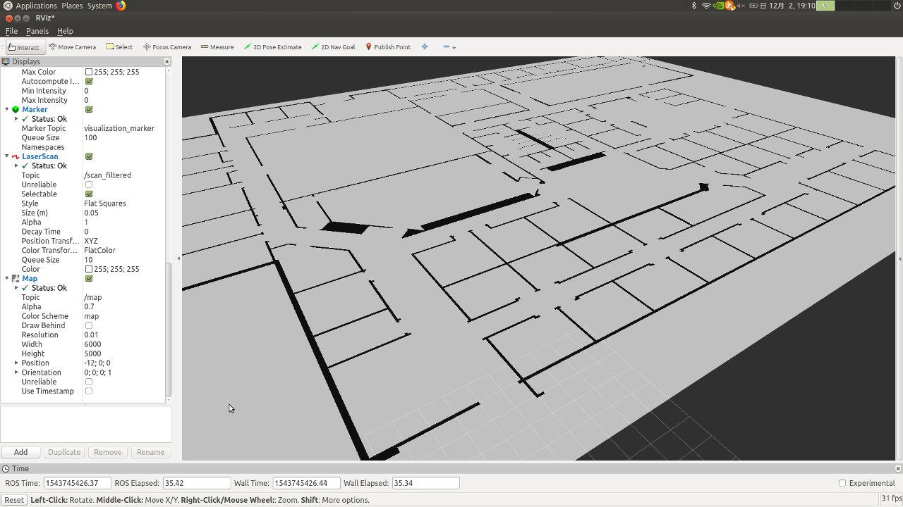
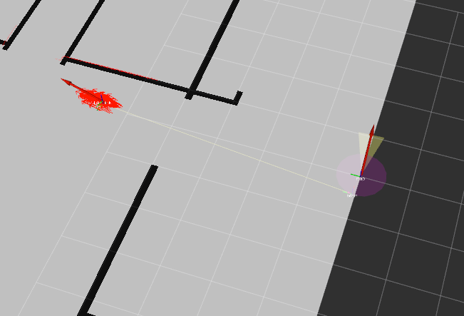

**************************************************************************
LiDARとAMCLを用いた自己位置推定
**************************************************************************
このページではLiDARとAdaptive Monte Carlo Localization (AMCL)を用いて自己位置推定を行います。

自己位置推定用の地図を作る
==========================================================================

自己位置推定を行うには事前に地図を用意する必要があります。
事前に用意した地図がない場合には、以下のどちらかの方法で地図を作成してください。

:doc:`../tips/build_map_gazebo_plugin/build_map_gazebo_plugin`
  Gazebo Pluginを使用する
:doc:`../tips/build_map_gmapping/build_map_gmapping`
  gmappingを使用する

Gazebo Pluginを使って地図を作成する
--------------------------------------------------------------------------
このページではGazebo Pluginを使用する方法について説明します。
Gazebo Pluginを作成するのは発展的な内容を含むため、今回はすでに作成済みのプラグインを使用します。
まずは、プラグインが含まれているパッケージをダウンロードしてビルドしましょう。

.. code-block:: bash

  cd ~/catkin_ws/src
  git clone https://github.com/uenota/dronedoc.git
  cd ..
  catkin build

次に、地図出力用のプラグインを使えるようにするために、Worldファイルに以下の内容を追加します。

.. code-block:: xml

    <plugin filename="map_builder.so" name="map_builder"/>

以下の例の様になればOKです。

.. code-block:: xml

  <?xml version ='1.0'?>
  <sdf version ='1.4'>
    <world name='default'>
      <include>
        <uri>model://ground_plane</uri>
      </include>

      <include>
        <uri>model://sun</uri>
      </include>

      <include>
        <uri>model://willowgarage</uri>
      </include>

      <plugin filename="map_builder.so" name="map_builder"/>
    </world>
  </sdf>

地図を出力する
--------------------------------------------------------------------------
マップを作りたいワールドを起動します。

.. code-block:: bash

  roslaunch gazebo_ros empty_world.launch world_name:=~/catkin_ws/src/px4_sim_pkg/worlds/willowgarage.world

Gazeboが起動したら以下のコマンドを実行します。

.. code-block:: bash

  rosrun dronedoc request_publisher 10 0.01 "(-12,0)" 60 50 map.png 255

このコマンドを実行すると、x,y座標が(-12, 0)の点を原点として、50m x 60mの矩形に囲まれた領域の、高さ10mより下にある障害物のマップがカレントディレクトリに ``map.png`` として作成されます。
グリッドの間隔は0.01mで、グリッドが占有されていると判断するしきい値は255です。
また、同時に地図の設定ファイルも ``~/map.yaml`` として生成されます。

このコマンドの使用方法は以下のとおりです。

.. code-block:: bash

  Usage: rosrun dronedoc request_publisher a1 a2 a3 a4 a5 [a6 a7]
	a1: height
	a2: resolution
	a3: "(origin.x, origin.y)"
	  Origin is the point on lower left corner of map image
	a4: map_width
	a5: map_height
	a6: filename	[default="map"]
	a7: threshold	[default=255]

以下のようなワールドに対して上記のコマンドを実行すれば、

.. image:: imgs/willow_garage.png

次のような地図が生成されます。
画像左下が原点です。

.. image:: imgs/willow_garage_map.png

AMCLを使って自己位置推定を行う
==========================================================================
モンテカルロ位置推定（Monte Carlo Localization）は、パーティクルフィルタを用いて自己位置推定を行う手法です。
このアルゴリズムではロボットの位置の確率分布をパーティクルの分布で表現し、その分布を、観測した情報を元に更新することで自己位置の推定を行います。

適応的モンテカルロ位置推定（Adaptive Monte Carlo Localization）は、モンテカルロ位置推定で用いる粒子の数を動的に調整することのできるアルゴリズムです。

今回はROSの `amclパッケージ <http://wiki.ros.org/amcl>`_ を使います。
また、前節で作成した地図情報を利用するために、 `map_serverパッケージ <wiki.ros.org/map_server>`_ も使用します。

map_serverを使って地図情報をパブリッシュする
--------------------------------------------------------------------------
amclは ``map`` トピックにパブリッシュされている地図情報を用いて自己位置推定を行うので、前節で作成した地図の情報をパブリッシュしてやる必要があります。

以下のコマンドで地図の情報をパブリッシュするノードを起動します。
map.yamlは地図画像と一緒に生成される設定ファイルです。

.. code-block:: bash

  rosrun map_server map_server map.yaml

Rvizを起動して ``/map`` トピックを表示すれば以下の画像のような地図が表示されます。

地図が表示されない場合はGlobal OptionのFixed Frameが ``map`` になっているか確認してください。

amclノードを起動する
--------------------------------------------------------------------------
次にamclノードを起動するためのLaunchファイルを書きます。
amclノードには多くのパラメータがあり、パラメータのチューニングによって自己位置推定の精度は影響を受けます。
pr2_navigationパッケージの `amcl_node.xml <https://github.com/PR2-prime/pr2_navigation/blob/hydro-devel/pr2_navigation_global/amcl_node.xml>`_ など、既存のLaunchファイルを参考にするとよいでしょう。
このLaunchファイルでは、レーザースキャンのトピックが ``base_scan`` になっているので、使用する場合は自分の使うセンサの設定に合わせてトピック名を変更しましょう。
また、base_frame_idとodom_frame_idも自分の使用するロボットの構成と同じように変更する必要があります。

amclの各パラメータとその解説は `amclのROS Wikiページ <http://wiki.ros.org/amcl>`_ にあるのでパラメータをチューニングする際には参考にしてください。

map_serverの起動を含めたlaunchファイルは以下のとおりです。

.. literalinclude:: ../../../launch/amcl.launch
  :linenos:
  :language: xml
  :caption: amcl.launch

PX4 SITLシミュレータを起動する
--------------------------------------------------------------------------
最後に、PX4 SITLシミュレータを起動するLaunchファイルを作成します。

Teleopノードを使う
--------------------------------------------------------------------------
.. mavros_extras の teleopを参考にする
.. OFFBOARDにすることをわすれない！！
.. -rc だったらoffboardじゃなくてもできそう？

実行する
--------------------------------------------------------------------------
.. image:: imgs/initpose.png

最初は以下の画像のように姿勢（赤矢印）が分布していますが、

.. image:: imgs/initest.png

データを観測するにつれて姿勢の分散は小さくなっていきます。

以下の動画では、途中で壁にぶつかってしまっていますが、影響なく位置推定ができていることがわかります。

.. image:: imgs/amcl.gif

参考
==========================================================================
`モンテカルロ位置推定を使用した TurtleBot の位置推定 <https://jp.mathworks.com/help/robotics/examples/localize-turtlebot-using-monte-carlo-localization.html>`_
  モンテカルロ位置推定の解説
`Navigation Stack を理解する - 3.1 amcl: ROSで遊んでみる <https://qiita.com/MoriKen/items/87be494f048ea03fdab8>`_

`Monte Carlo Localization <https://en.wikipedia.org/wiki/Monte_Carlo_localization>`_

`Monte Carlo Localization for Mobile Robots <https://www.cc.gatech.edu/~dellaert/ftp/Dellaert99icra.pdf>`_

`Particle Filter <https://en.wikipedia.org/wiki/Particle_filter>`_

`A Tutorial on Particle Filtering and Smoothing: Fifteen years later <https://www.seas.harvard.edu/courses/cs281/papers/doucet-johansen.pdf>`_

`Adaptive Monte Carlo Localization <http://roboticsknowledgebase.com/wiki/state-estimation/adaptive-monte-carlo-localization/>`_