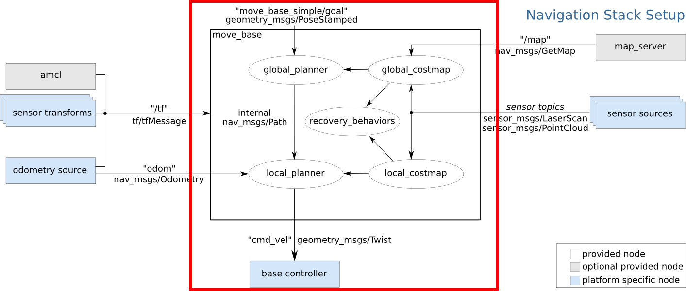

=====================================
GPSを用いた自律飛行
=====================================
このページの内容は `Setup and Configuration of the Navigation Stack on a Robot <http://wiki.ros.org/navigation/Tutorials/RobotSetup>`_ を参考にしています。

以下の赤枠内の部分が経路計画と障害物回避に必要な部分です。
経路計画と障害物回避を含む自律飛行を行うためには、

1. 座標系の間の関係がTFを使ってパブリッシュされていること
2. センサデータがパブリッシュされていること
3. オドメトリ情報がTFとnav_msgs/Odometryメッセージでパブリッシュされていること
4. geometry_msgs/Twistメッセージを使ってロボットを操作できること

が必要です。
以降ではそれぞれの設定について見ていきます。

  出典: http://wiki.ros.org/navigation/Tutorials/RobotSetup

TF
=====================================
ロボットの座標系間の関係はSDFファイル（model.sdfなど）で定義されており、これらの間のTFはシミュレーションでは自動でパブリッシュされます。

TODO: frame.pdfの画像

TODO: RvizでTF表示した画像

センサ情報
=====================================
今回は障害物の検出に2D LiDARを使います。
``models/iris_2d_lidar/model.sdf`` 内でLiDARの設定を以下のようにしたので、
LiDARの点群データは ``/laser/scan`` トピックにパブリッシュされます。

.. code-block:: xml

  <plugin name="LaserPlugin" filename="libgazebo_ros_laser.so">
    <robotNamespace></robotNamespace>
    <topicName>/laser/scan</topicName>
    <frameName>lidar_link</frameName>
  </plugin>

また、LiDARの設置してあるフレームは ``lidar_link`` です。
このフレームは ``base_link`` フレームの子要素になっています。
つまり、 ``base_link`` → ``lidar_link`` のようにTFがパブリッシュされています。

オドメトリ情報
=====================================
TFをパブリッシュする
-------------------------------------
PX4 SITLシミュレーションでは、mavrosを使って機体のTFをパブリッシュすることができます。
しかし、mavros_posix_sitl.launchを使った場合は、デフォルトではTFがパブリッシュされません。

TFがパブリッシュされるようにするには、 ``/mavros/local_position/tf/send`` と ``/mavros/global_position/tf/send`` パラメータの値を ``true`` にする必要があります。

また、以降でmove_baseを使うための設定として、 ``/mavros/local_position/tf/frame_id`` と、 ``/mavros/local_position/tf/frame_id`` のパラメータの値を ``odom`` にしておきます。

.. code-block:: xml
  :linenos:
  :caption: mymodel_sitl_tf.launch

  <launch>

      <arg name="sdf" default="$(find px4_sim_pkg)/models/iris_2d_lidar/model.sdf" />

      <include file="$(find px4)/launch/mavros_posix_sitl.launch" >
          <arg name="sdf" value="$(arg sdf)" />
      </include>

      <param name="/mavros/local_position/tf/send" type="bool" value="true" />
      <param name="/mavros/local_position/frame_id" type="str" value="odom" />
      <param name="/mavros/local_position/tf/frame_id" type="str" value="odom" />

      <param name="/mavros/global_position/tf/send" type="bool" value="true" />

  </launch>

nav_msgs/Odometryをパブリッシュする
-------------------------------------
nav_msgs/Odometryメッセージがパブリッシュされるトピックはmavrosには用意されていないので、自分で用意する必要があります。

`ROS Wikiのチュートリアル <http://wiki.ros.org/navigation/Tutorials/RobotSetup/Odom>`_ を参考にしてノードを作成しましょう。

``map`` から ``base_link`` へのTFはすでにパブリッシュされているので、今回は ``nav_msgs::Odometry`` メッセージのパブリッシャを書くだけで構いません。

Pythonのコード例は、 :doc:`odom_pub_py` を参考にしてください。

.. literalinclude:: ../../src/odom_publisher.cpp
  :language: cpp
  :linenos:
  :caption: odom_publisher.cpp

コード解説
^^^^^^^^^^^^^^^^^^^^^^^^^^^^^^^^^^^^^

.. code-block:: cpp

  #include <ros/ros.h>
  #include <nav_msgs/Odometry.h>
  #include <geometry_msgs/PoseStamped.h>
  #include <geometry_msgs/TwistStamped.h>
  #include <geometry_msgs/Quaternion.h>
  #include <tf/transform_datatypes.h>

使用するメッセージを使うのに必要なヘッダファイルをインクルードしています。
``tf/transform_datatypes.h`` は、 ``createQuaternionFromYaw`` 関数を使用するために必要です。

.. code-block:: cpp

  ros::Publisher odom_pub = nh.advertise<nav_msgs::Odometry>("odom", 50);

``nav_msgs/Odometry`` メッセージのパブリッシャです。

.. code-block:: cpp

  ros::Subscriber local_pos_sub = nh.subscribe<geometry_msgs::PoseStamped>("mavros/local_position/pose", 50, local_pos_cb);
  ros::Subscriber local_vel_sub = nh.subscribe<geometry_msgs::TwistStamped>("mavros/local_position/velocity", 50, local_vel_cb);

``nav_msgs/Odometry`` メッセージのフィールドで使われる位置と速度のサブスクライバです。

.. code-block:: cpp

  geometry_msgs::PoseStamped local_pos;
  void local_pos_cb(const geometry_msgs::PoseStamped::ConstPtr& msg)
  {
    local_pos = *msg;
  }

  geometry_msgs::TwistStamped local_vel;
  void local_vel_cb(const geometry_msgs::TwistStamped::ConstPtr& msg)
  {
    local_vel = *msg;
  }

それぞれのサブスクライバのコールバック関数です。
グローバル変数にメッセージを格納するだけのシンプルなものです。

.. code-block:: cpp

    tf::Quaternion tf_quat = tf::createQuaternionFromYaw(local_pos.pose.orientation.z);

    geometry_msgs::Quaternion odom_quat;
    tf::quaternionTFToMsg(tf_quat, odom_quat);

z軸周りの回転（Yaw）からTFのクォータニオンを生成して、それをROSメッセージに変換しています。

.. code-block:: cpp

  nav_msgs::Odometry odom;
  odom.header.stamp = ros::Time::now();
  odom.header.frame_id = "odom";

  odom.pose.pose.position.x = local_pos.pose.position.x;
  odom.pose.pose.position.y = local_pos.pose.position.y;
  odom.pose.pose.position.z = 0.0;
  odom.pose.pose.orientation = odom_quat;

  odom.child_frame_id = "base_link";
  odom.twist.twist.linear.x = local_vel.twist.linear.x;
  odom.twist.twist.linear.y = local_vel.twist.linear.y;
  odom.twist.twist.angular.z = local_vel.twist.angular.z;

  odom_pub.publish(odom);

``nav_msgs/Odometry`` メッセージの各フィールドを埋めてパブリッシュしています。
``nav_msgs/Odometry`` メッセージのフィールドについては、 `nav_msgs/Odometry Message <http://docs.ros.org/melodic/api/nav_msgs/html/msg/Odometry.html>`_ を見てください。

速度指令
=====================================
PX4 SITLシミュレーションでは、 ``/mavros/setpoint_velocity/cmd_vel`` トピックに速度指令を送信することでドローンを移動させることができます。

設定ファイルを書く
=====================================
大域的経路計画と局所的経路計画
-------------------------------------
コストマップは事前に与えられた地図情報やセンサから得られた障害物の情報をもとに構築される地図で、経路計画に用いられます。（ `参考 <https://qiita.com/MoriKen/items/d5cd6208143d6c40caff#%E5%A4%A7%E5%9F%9F%E3%81%A8%E5%B1%80%E6%89%80%E3%81%AE%E6%AF%94%E8%BC%83>`_ ）

大域的経路計画では、スタートからゴールまでの経路を計画します。
大域的経路計画においては、グローバル（大域的）コストマップが使われます。

局所的経路計画では、障害物回避のための経路を計画します。
局所的経路計画を行うために、ローカル（局所的）コストマップが使用されます。

大域的経路計画を行う経路計画手法のことをグローバルプランナー、局所的経路計画を行う手法のことをローカルプランナーといいます。
グローバルプランナーにはダイクストラ法やA*法が、ローカルプランナーにはDynamic Window Approach（DWA）などがあります。

コストマップの設定
-------------------------------------
コストマップの設定はyamlファイルに記述します。
共通の設定、大域的コストマップの設定、局所的コストマップの設定用の3つの設定ファイルを以下のように準備します。

以下の設定は必要最小限のものです。
他の設定やコストマップの詳細については `costmap_2dのROS Wikiページ <http://wiki.ros.org/costmap_2d>`_ を見てください。

共通設定
^^^^^^^^^^^^^^^^^^^^^^^^^^^^^^^^^^^^^
.. literalinclude:: ../../config/costmap_common_params.yaml
  :language: yaml
  :caption: costmap_common_params.yaml
  :linenos:

それぞれのパラメータの意味は以下のとおりです。

``obstacle_range``
  コストマップに反映する障害物の距離。
  この例では2.5mより近くにある障害物がコストマップに反映される。
``raytrace_range``
  センサデータがこの数値以上の場合には、ロボットからこの数値の距離までの間に障害物はないと判断します。
``footprint``
  ロボットの形状を多角形で指定します。中心は ``(0.0, 0.0)`` です。
  ロボットの外形が円である場合には、 ``robot_radius`` パラメータを使います。
``inflation_radius``
  障害物の影響がコストに反映される最大の距離です。
  今回の例では0.55mに設定してありますが、これは障害物からの距離が0.55m以上であるすべての経路は同じコストを持つということです。
``observation_sources``
  コストマップに渡される情報を得るセンサを設定します。
``sensor_frame``
  センサーの座標系（フレーム）です。
``data_type``
  トピックにパブリッシュされているメッセージの型（今回は ``sensor_msgs/LaserScan`` ）です。
``topic``
  センサデータがパブリッシュされているトピックです。
``marking``
  ``true`` の場合には、障害物をコストマップに追加する際にこのセンサの情報が使用されます。
``clearing``
  ``true`` の場合には、障害物をコストマップから除去する際にこのセンサの情報が使用されます。

大域的コストマップの設定
^^^^^^^^^^^^^^^^^^^^^^^^^^^^^^^^^^^^^^
.. literalinclude:: ../../config/global_costmap_params.yaml
  :language: yaml
  :caption: global_costmap_params.yaml
  :linenos:

``global_frame``
  大域的コストマップの座標系（フレーム）を設定します
``robot_base_frame``
  （コストマップが参照する）ロボットのベース座標系（フレーム）を設定します
``update_frequency``
  コストマップの更新周期（Hz）を定義します
``static_map``
  ``true`` にすると、既存のマップもしくはmap_severから提供されるマップを使ってコストマップを初期化されます。
  マップを使わずに初期化する際には ``false`` にします。

局所的コストマップの設定
^^^^^^^^^^^^^^^^^^^^^^^^^^^^^^^^^^^^^
.. literalinclude:: ../../config/local_costmap_params.yaml
  :language: yaml
  :caption: local_costmap_params.yaml
  :linenos:

``global_frame`` , ``robot_base_frame`` , ``update_frequency`` , ``static_map`` については大域的コストマップの設定と同じです。

``publish_frequency``
  コストマップを表示するためのデータをパブリッシュする周波数（Hz）です
``rolling_window``
  ``true`` にすると、ロボットが移動しても局所的コストマップの中心がロボットに追従するようになります。
``width``
  コストマップの幅（m）
``height``
  コストマップの高さ（m）
``resolution``
  コストマップの解像度（cell/m）

ローカルプランナーの設定
-------------------------------------
ロボットのベースに与える速度指令を計算するためにローカルプランナーを使用します。
パラメータの詳細やローカルプランナーの概要については `base_local_plannerのROS Wikiページ <http://wiki.ros.org/base_local_planner>`_ を見てください。

以下の設定ファイルではロボットの速度と加速度の最大値、最小値を定義しています。

``holonomic_robot`` パラメータはロボットがホロノミックかどうかを定義します。
ロボットの制御可能な自由度が全体の自由度と等しい場合にはホロノミックであるといい、そうでない場合はノンホロノミック（もしくは非ホロノミック）であるといいます。
例えば、自動車は全体の自由度が3（x, y, yaw）ですが、制御可能な自由度は2（x, yaw）であり、ノンホロノミックなシステムであるといえます。
ドローンの場合は制御可能な自由度（x, y, z, roll, pitch, yaw）が全体の自由度と等しいのでホロノミックなシステムです。

.. literalinclude:: ../../config/base_local_planner_params.yaml
  :language: yaml
  :caption: base_local_planner_params.yaml
  :linenos:

Launchファイルを書く
=====================================
このLaunchファイルでは、上記の設定ファイルをすべて ``px4_sim_pkg/config`` 以下に保存していることを想定しています。

以下の内容を、 ``px4_sim_pkg/launch`` 以下に、navigation.launchとして保存してください。

.. code-block:: xml
  :caption: navigation.launch
  :linenos:

  <launch>

    <node pkg="px4_sim_pkg" type="odom_publisher" name="odom_publisher"/>

    <node pkg="move_base" type="move_base" name="move_base" respawn="false" output="screen">

      <!-- Common params for costmap -->
      <rosparam command="load" ns="global_costmap" file="$(find px4_sim_pkg)/config/costmap_common_params.yaml"/>
      <rosparam command="load" ns="local_costmap" file="$(find px4_sim_pkg)/config/costmap_common_params.yaml"/>

      <!-- Params for global costmap -->
      <rosparam command="load" file="$(find px4_sim_pkg)/config/global_costmap_params.yaml"/>

      <!-- Params for local costmap -->
      <rosparam command="load" file="$(find px4_sim_pkg)/config/local_costmap_params.yaml"/>

      <!-- Params for local planner -->
      <rosparam command="load" file="$(find px4_sim_pkg)/config/base_local_planner_params.yaml"/>
    </node>

  </launch>

ドローンのパラメータの変更
=====================================
二次元の自己位置推定やマッピングの精度を高めるためには、できるだけセンサを水平に保つ必要があります。
ドローンのパラメータを設定してピッチ角とロール角が一定以上にならないようにしましょう。

また、デフォルトではRCとの接続が切れた場合に自動でホームポジションに戻るようになっているので、RC信号のチェックをしないようにすることで、その設定も解除しておきます。

以下のパラメータの設定を変更します。
利用可能なパラメータ一覧は `Parameter Reference <https://docs.px4.io/en/advanced_config/parameter_reference.html>`_ を参照してください。

.. csv-table::
  :header: パラメータ名, min > max (Incr.), デフォルト, 単位

  FW_P_LIM_MAX, 0.0 > 60.0 (0.5), 45.0, deg
  FW_P_LIM_MIN, -60.0 > 0.0 (0.5), -45.0, deg
  FW_R_LIM, 35.0 > 65.0 (0.5), 50.0, deg
  COM_RC_IN_MODE, 0 > 2, 0,

パラメータを設定する方法は以下の2種類があります。

- コマンドで設定する
- 設定ファイルを使う

コマンドで設定する方法は簡単ですが、毎回設定しなければなりません。
設定ファイルを使う方法は準備が必要ですが、基本的に一度準備すれば毎回設定し直す必要はありません。

コマンドで設定する
-------------------------------------
PX4シミュレータが起動したら、以下のコマンドを実行します。
今回は試しに以下の数値を設定してみます。
数値は適宜変更してください。

.. code-block:: none

  param set FW_P_LIM_MAX 10.0
  param set FW_P_LIM_MIN -10.0
  param set FW_R_LIM 40.0
  param set COM_RC_IN_MODE 1

コマンドが成功したら次のように表示されます。
以下はFW_R_LIMの例です。

.. code-block:: none

  FW_R_LIM: curr: 50.0000 -> new: 40.0000

パラメータの設定を行うコマンドの記法は以下のとおりです。

.. code-block:: none

  param set パラメータ名 値

設定ファイルを使う
-------------------------------------
PX4シミュレーションの起動は、起動スクリプト（ ``~/.ros/etc/init.d-posix/rcS`` ）によって行われ、その中で設定スクリプトが読み込まれることで機体のパラメータなどが設定されます。

シミュレーションで使われる機体の設定スクリプトは、 ``~/.ros/etc/init.d-posix`` 以下にあり、ここからロードされます。
なので、設定ファイルを作成した後にこのディレクトリに移動、もしくはシンボリックリンクを貼る必要があります。
手動でファイルを移動させても良いのですが、更新したあとに移動し忘れたり、初期設定の際に移動し忘れたりする恐れがあります。
そこで、今回はCMakeLists.txtを編集することでビルドしたら自動で移動してくれるようにします。

この節では設定スクリプトの作成とCMakeLists.txtへの記述の追加を行います。

以下のような内容の設定スクリプトを ``px4_sim_pkg/posix_airframes`` 以下に、 ``70010_iris_2d_lidar`` という名前で保存します。

.. literalinclude:: ../../posix_airframes/70010_iris_2d_lidar
  :linenos:
  :caption: 70010_iris_2d_lidar

また、以下の内容をCMakeLists.txtに追加します。
以下では、 ``add_custom_target`` を使って、 ``iris_2d_lidar`` という、シンボリックリンクを作成するターゲットを作成しています。

.. code-block:: cmake
  :linenos:

  cmake_policy(SET CMP0054 NEW)

  set(PACK_AIRFRAME_DIR ${CMAKE_CURRENT_SOURCE_DIR}/posix_airframes)
  set(LOCAL_AIRFRAME_DIR $ENV{HOME}/.ros/etc/init.d-posix)

  if(NOT EXISTS ${LOCAL_AIRFRAME_DIR}/70010_iris_2d_lidar)
    add_custom_target(iris_2d_lidar
                      ALL ln -s ${PACK_ROMFS_DIR}/70010_iris_2d_lidar $ {LOCAL_AIRFRAME_DIR}/)
  endif()

実行してみる
=====================================

ビルドする
-------------------------------------
オドメトリをパブリッシュするためのノードをビルドします。
CMakeLists.txtに以下の内容を追加するのを忘れないようにしましょう。

.. code-block:: cmake

  add_executable(odom_publisher src/odom_publisher.cpp)
  target_link_libraries(odom_publisher ${catkin_LIBRARIES})

Pythonノードを使う場合には忘れずに実行権限を与えておきます。

.. code-block:: bash

  cd ~/catkin_ws
  catkin_make

ノードを起動する
-------------------------------------
以下のコマンドを用いてLaunchファイルを起動します。

.. code-block:: bash

  roslaunch px4_sim_pkg mymodel_sitl.launch
  roslaunch px4_sim_pkg navigation.launch

TODO: gazebo画像

ゴールを送信する
-------------------------------------
TODO: Rvizからゴールを送信する

参考
=====================================
`move_base - ROS Wiki <http://wiki.ros.org/move_base>`_
  move_baseパッケージ

`Publishing Odometry Information over ROS <http://wiki.ros.org/navigation/Tutorials/RobotSetup/Odom>`_
  オドメトリをパブリッシュするノードを書く（ROS Wiki）
`ROS Navigation Stack について2 ~ Odometry生成ノードの作成 ~ <http://daily-tech.hatenablog.com/entry/2017/02/11/182916>`_
  オドメトリをパブリッシュするノードを書く
`obstacle_range & raytrace_range - precise explanation? <https://answers.ros.org/question/72265/obstacle_range-raytrace_range-precise-explanation/>`_
  obstacle_rangeとraytrace_rangeの意味について